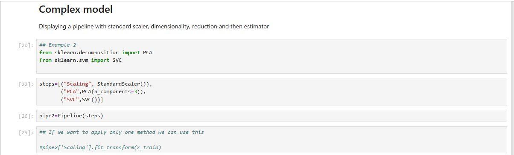

# Power-of-Sklearn-Pipelines

I recently worked on building Pipeline Models using sklearn to streamline the entire machine learning process—from preprocessing to prediction—all in a few clean, repeatable steps. Here's a quick breakdown of what I implemented:

🔹 Model 1: StandardScaler + LogisticRegression

Built a pipeline with data scaling and classification.
sed a synthetic dataset with 1000 rows and 20 features.
Split the data with train_test_split (test size: 33%) and made predictions using pipe.predict().

🔹 Model 2: StandardScaler + PCA + SVC

Added dimensionality reduction with PCAbefore fitting the Support Vector Classifier.
Followed the same preprocessing and prediction steps.

🔹 Model 3: Complex Pipeline with ColumnTransformer

Handled both numerical and categorical data.
 Used SimpleImputer and StandardScaler for numeric data.
 Applied appropriate transformers for categorical features.
 Combined everything using ColumnTransformer and finalized the model with LogisticRegression.

✅ The beauty of using Pipelines is their ability to encapsulate multiple steps—like imputation, scaling, encoding, and modeling—into one efficient and reproducible process.

 Whether you're working with small or large datasets, pipelines simplify and standardize your workflow.

💬 If you’re also exploring model pipelines or have tips/tricks to share, let’s connect in the comments!
Here is the link of the model :- https://lnkd.in/gpbmRxEz

 

 

 

 

 

 

 

 

 
